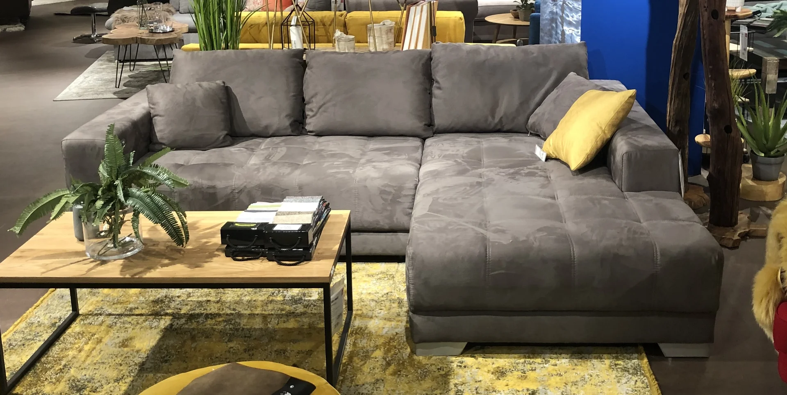
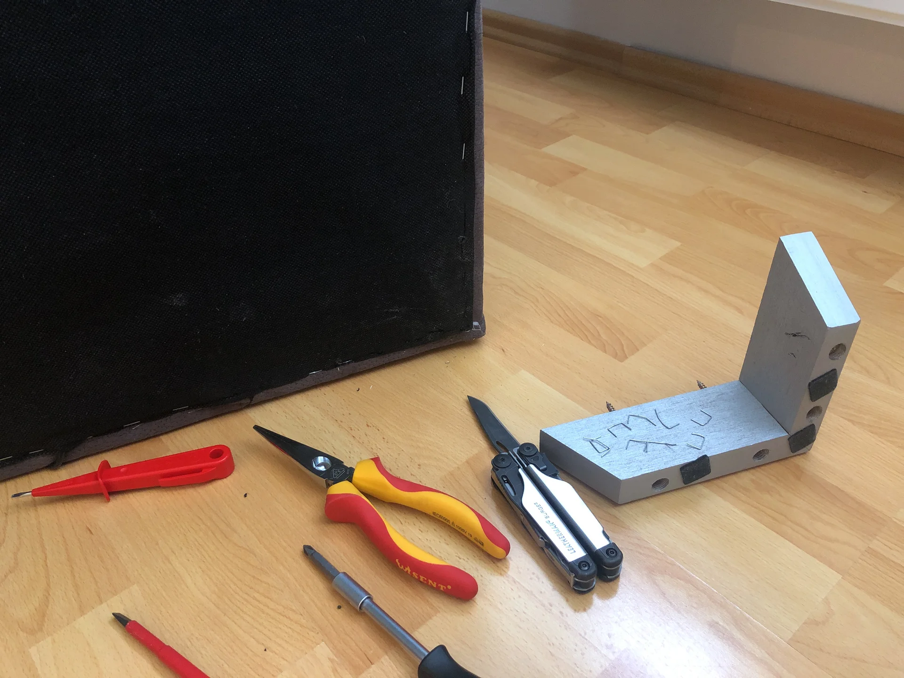
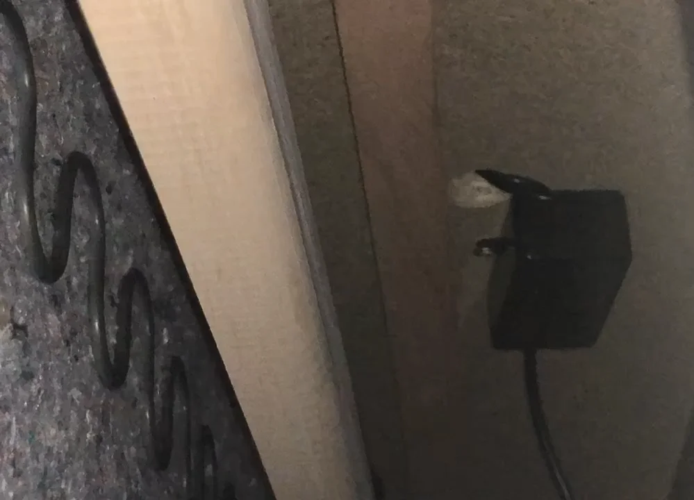
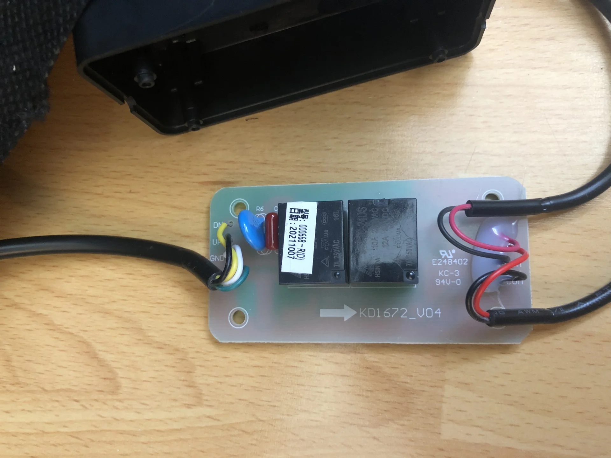
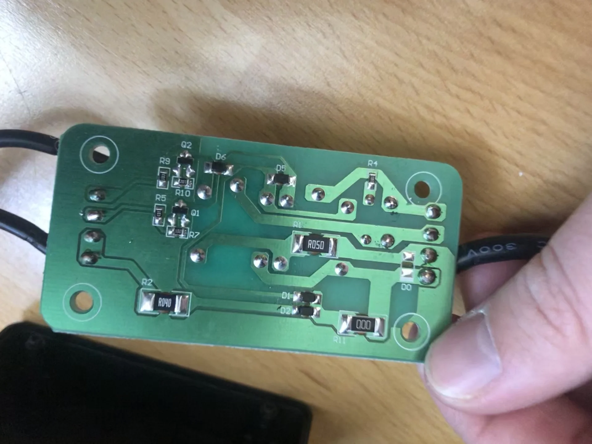
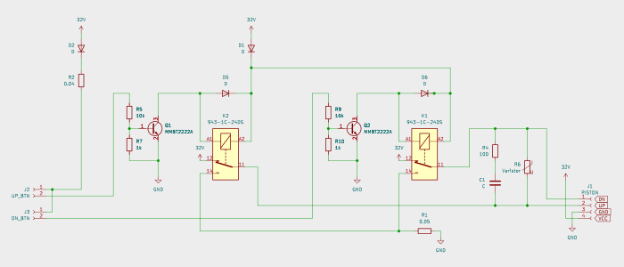
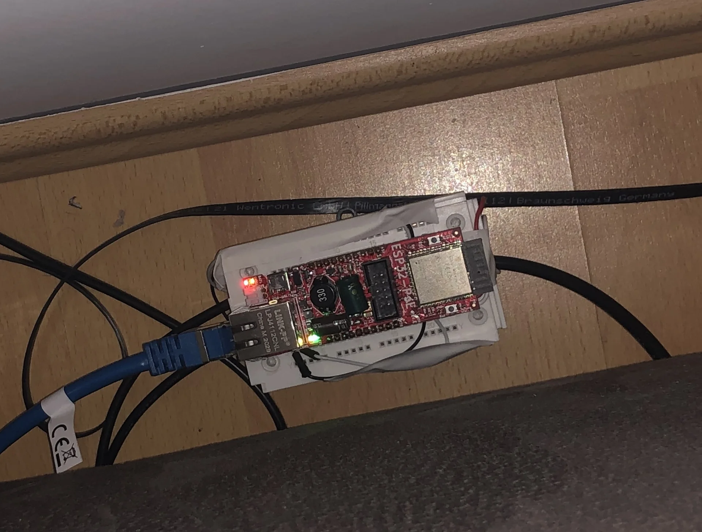

+++
title = "The Internet of Furniture"
summary = "How I reverse-engineered my electric sofa to work with Home Assistant using an ESP32. After frying a transistor and some emergency soldering, I now have a voice-controlled couch."
author = "Emanuel Mairoll"
date= "2022-05-22"
tags = ['IoT', 'Home Assistant', 'ESPHome', 'Electronics']
showTableOfContents = true
series = ["The Open Source Smart Home"]
series_order = 1
+++



Or: How I hooked up my Sofa to Home Assistant


__*Stories from the Open Source Smart Home - Part 1*__

When my grandma and me were shopping for furniture for my new flat, we stumbled upon the Corner Sofa *Merlin*. Its slim section extends into a full guest bed, which is already handy whenever someone stays over. What really sold me, though, was the control panel on the side: two buttons drive the entire mechanism. **Two. Electric. Buttons.**



My first thought was 

> Oh, how convenient for hosting guests.

My second one was 

> I need to IoT-ify this bad boy.

Because apparently, I can't look at perfectly functional piece of furniture without thinking: "You know what this needs? An IP address."

Two days after delivery, I already had the sofa flipped on its back with my screwdriver in hand. What followed was a dramatic tale - in three acts.

---

## Act I: The Circuit



The first challenge was getting inside my brand-new sofa without destroying it. Luckily, that was surprisingly easy: flip it onto its back, unscrew the right rear leg, and remove the staples holding the cover cloth in that corner. A couple of minutes later, I was lying next to an upside-down sofa, shining a flashlight into the darkness.

The hardware inside was just as simple: an electrically extendable piston, a power supply, and a suspicious black control box tying everything together. I unscrewed the box, opened it, and found a small circuit board inside.





Let's quickly go through what's happening here: The board is supplied with 32V, which passes through a 4Ω shunt to one terminal of each button. On the return path, every button goes through a 10kΩ resistor into a relay driver transistor and relay, which switch 32V and GND onto the "DN" and "UP" terminals of the piston.



So, game plan: Simply intercept the button signals and insert my own "implant" to hijack control. 

The buttons connected via a coupler, meaning theoretically no soldering required. Theoretically. (Narrator: There would be soldering.)

---

## Act II: The Implant

### Hardware Selection

For the implant, I needed something with Ethernet connectivity (because WiFi sucks for IoT), enough GPIO pins, and solid software support.

After my [other](/posts/iot4-heislberg) IoT adventures, I opted for an OLIMEX ESP32-POE again. It's reliable, well-documented (as in "fully Open Source"), and has everything I needed for the project.

The only feature I wished the ESP32-POE had was built-in circuitry for handling higher voltages. Since the board lacks onboard relays or optocouplers, I decided to interface directly with the sofa's control circuits.
For the output signals, I initially tried connecting the ESP's 3.3V GPIO pins directly to the transistor bases, but the existing 10kΩ inline resistors dropped too much voltage. One quick soldering job later, I had bridged those resistors and added 820Ω resistors on the breadboard instead to properly scale the voltage. This gave the transistors exactly what they needed to switch reliably.

For the input signals, the sofa's buttons supply 32V - definitely not ESP-friendly territory. A simple voltage divider using 10kΩ and 1kΩ resistors brought those signals down to a safe 3V range that the ESP could read.



### Software: The Path of Least Resistance

I really, REALLY didn't want to spend my evenings debugging a sofa. Can you imagine explaining that to your friends? "Sorry, can't come out tonight, my couch threw a segfault."

Luckily, ESPHome spared me that conversation. It turns ESP boards into Home Assistant devices using declarative YAML, so I could define the sofa there without writing and maintaining separate firmware for it. It has a huge library of "components" covering everything from physical layer (Ethernet, WiFi, OpenThread) up to application layer (MQTT, HTTP, Home Assistant). And while I didn't exactly *expect* to find a component for `electrically-extendable-sofa`, there *is* a `cover` component designed for motorized window blinds. It already provides open, close, and stop actions, timed position tracking, and direct Home Assistant integration. From Home Assistant's perspective, my sofa was now simply a very wide window blind.

Here is the finished configuration:

```yaml
esphome:
  name: smart-sofa
esp32:
  board: esp32-poe
  framework:
    type: arduino
logger:
api: # Enable Home Assistant API
  password: "<API_PASSWORD>"
ota: # For Over The Air updates
  password: "<OTA_PASSWORD>"
ethernet:
  type: LAN8720
  mdc_pin: GPIO23
  mdio_pin: GPIO18
  clk_mode: GPIO17_OUT
  phy_addr: 0
  power_pin: GPIO12

cover:
  - platform: time_based
    id: sofa
    name: "Sofa"
    assumed_state: true
    open_action:
      - switch.turn_on: extend_couch
    open_duration: 9.1s
    close_action:
      - switch.turn_on: retract_couch
    close_duration: 9.1s
    stop_action:
      - switch.turn_off: extend_couch
      - switch.turn_off: retract_couch

binary_sensor:
- platform: gpio
  pin:
    number: GPIO35
    inverted: true
  id: button_open
  on_press:
    then:
      - lambda: |
          if (id(sofa).current_operation == COVER_OPERATION_IDLE && !id(sofa).is_fully_closed()) {
            id(sofa).close();
          } else {
            id(sofa).stop();              
          }
- platform: gpio
  pin:
    number: GPIO39
    inverted: true
  id: button_close
  on_press:
    then:
      - lambda: |
          if (id(sofa).current_operation == COVER_OPERATION_IDLE && !id(sofa).is_fully_open()) {
            id(sofa).open();
          } else {
            id(sofa).stop();              
          }

switch:
  - platform: gpio
    pin: GPIO32
    interlock: &interlock [extend_couch, retract_couch]
    id: extend_couch
  - platform: gpio
    pin: GPIO33
    interlock: *interlock
    id: retract_couch

```

I hooked everything together on a testing breadboard, tested it, and it worked like a charm. The sofa responded perfectly, Home Assistant detected it immediately, project basically done.

And then...

---

## Act III: The Accident

You know those safety warnings everyone ignores? "Always disconnect power before changing the wiring"? 

Yeah, obviously I didn't do that.

I had one cable carrying 32V that I'd been using to test the voltage divider. While moving things around, that cable decided to go on an adventure.

And the golden rule with transistors - never put more than 0.7V onto the base without a resistor?

Yeah, obviously my 32V cable landed directly on an unprotected transistor base.

*Silence.*

*Faint magic smoke.*

"Fuck."

I tested it anyway... but the transistor was fried. Completely dead.

### The Resurrection

Now I needed to source a replacement transistor. In hindsight, I could have used pretty much any similar transistor, but I wanted the exact same one out of spite.

Fortunately, I'm still on good terms with my electronics teachers from technical high school (HTL). One phone call, a nostalgic tour through the old labs and about two hours later, Mr. Lindner had found me the exact replacement transistor.

What followed was precision SMD soldering with a 20€ soldering iron while kneeling in front of my sofa like I was proposing to it. Somehow, through a combination of steady hands and what I can only assume was divine intervention, I got the tiny transistor properly soldered.

I can't show you pictures of the soldering job though, because... ehm... I lost them, or something like this.

But in any case, I then rebuilt everything properly on a smaller, fitting breadboard, connected it to the **UNPLUGGED** sofa, mounted it inside with double-sided tape, reassembled everything, held my breath, and powered it on.

It was alive again.



## The Aftermath: Living in the Future

My sofa is now a full-fledged member of my smart home. I can extend it from Home Assistant, include it in automations and scenes, or say, "Hey Siri, deploy the guest accommodations." The original buttons still work exactly as before, so everyone else can continue pretending that it is normal furniture.

Is this practical? Debatable. Is it necessary? Absolutely not. Is it awesome? You bet it is.

*This is Part 1 of my "Stories from the Open Source Smart Home" series.*

*Special thanks to Mr. Lindner for the emergency transistor supply, and to my grandma for the interior design advice that led us to this particular sofa (though I'm pretty sure "hackable electronics" wasn't on her list of criteria). No sofas were permanently harmed in the making of this project.*
