+++
title = "Hacking My Home Router, Part 1"
summary = "After Yallo removed bridge mode from its fiber router, Aaron and I desoldered the NAND from a spare unit and extracted the raw firmware."
author = "Emanuel Mairoll"
date= "2026-09-05"
tags = ['Hardware Hacking', 'Reverse Engineering', 'Router', 'Firmware', 'NAND', 'BGA']
showTableOfContents = true
series = ["Home Router"]
series_order = 1
+++


Or: What to do when your ISP removes bridge mode after you sign the contract


I *only* wanted to enable bridge mode. Instead, my friend [Aaron Schramm](https://linkedin.com/in/aaron-schramm-308823271) and I ended up desoldering the router's NAND chip under a microscope as part of what has become one of my longest-running projects.

This series documents our attempt to understand the locked-down Sagemcom router Yallo supplied with my fiber connection and make its hidden modem mode actually useful. Part 1 covers the initial web reconnaissance and the chip-off NAND dump, with Aaron providing the electrical engineering expertise and his frankly ridiculous rework setup.

## The contract

When I moved to Zurich in 2024, I wanted fiber, but most plans cost more than I was willing to pay. Then I found Yallo's 10 Gbit/s offer for CHF 40 a month, advertised as an "extreme discount, just now." Yeah, sure. Still, the price was considerably below the other offers I had found.

The subscription included a mandatory Sagemcom F5685LGB, sold as the Yallo Home Fiber Box 2. I already planned to use my own hardware for routing, firewalling, and Wi-Fi, leaving the Sagemcom to terminate the fiber connection in bridge mode.

Before ordering, I specifically confirmed with Yallo that bridge mode was supported. Based on that promise, I signed the 24-month contract. When the router arrived, the setting was present in the web interface as expected, so I bought the remaining hardware for my network.

A few days later, when I finally went to set everything up, the option had disappeared.

After roughly twenty calls, the conversation eventually boiled down to this:

> Yallo: "No, we cannot offer bridge mode."

> Me: "Bruh, it was literally in the menu."

> Yallo: "Yes. That was a mistake."

I had asked about bridge mode before signing and seen the option on the actual device. Now Yallo was gaslighting me, while I was still locked into the 24-month contract.

The connection itself worked, but only with their Sagemcom doing all the routing. That meant placing a locked-down and questionably safe vendor box at the entrance to my network, while the hardware I had bought for exactly that job sat behind it. Cancelling was no longer an option, and Yallo clearly was not going to fix it.

_Alright then, I'll do it myself._

## Initial reconnaissance

The first goal was to find out whether there was still a way to put the device into modem mode. I clicked through the web interface with the browser developer tools open and mapped the API calls made by each page. The router itself was about as restricted as expected: the interface was slow, most useful settings were missing, and even the LAN range was hard-coded to `192.168.0.1/24`.

The interface turned out to be a vendor-generic frontend backed by a JSON API. Much of the Yallo-specific stuff lived entirely in the browser: the branding, page structure, input validation, and visibility of individual settings were all controlled by the frontend. These feature flags therefore provided a useful map of the router's functionality, including pages that Yallo had removed from the normal sidebar navigation without removing the underlying code. For those pages, the only barrier was the missing link to them... That was not an especially reassuring security boundary for the box sitting between my network and the internet.

Funnily enough, modem mode was one of those pages. Entering its URL directly still opened the page, which submitted a single Boolean to `PUT /rest/v1/system/modemmode`. According to the page, enabling it would disable Wi-Fi and move local management to `192.168.100.1`. The request succeeded, but the router I connected behind the Sagemcom never received a usable internet connection. Seemingly, that one Boolean triggered more stuff inside the box, and once the Sagemcom stopped acting as the router, my own device would need to reproduce the relevant parts of that setup. To make modem mode actually useful, I needed to reverse-engineer how it was implemented, which meant getting a shell on the system.

With that goal in mind, I spent a little longer on the software side before reaching for a screwdriver. The API enumeration exposed part of the router's account model: my normal customer session belonged to user 3, while user 1 was labelled CSR and user 2 was named `cusadmin`. Both appeared more privileged, but neither accepted the credentials Yallo had supplied with the router.

The diagnostics were the next obvious input surface. Ping and traceroute features are often thin wrappers around system utilities, so I tried a handful of basic command-injection payloads. They gave no additional output or other visible side effects. The DDNS page provided another set of inputs, with five supported providers and the usual hostname, username, and password fields. I repeated the same quick tests across them, with the same result. I only gave them a quick pass; if either had dropped me into a shell, I could have pulled the firmware and skipped the hardware work entirely.

The final software shortcut was the configuration export. Instead of readable settings, each download produced an opaque encrypted blob. Even repeated exports of an unchanged configuration contained different bytes, so a simple comparison gave no further clues.

Before opening the router, I made one last attempt to avoid the hardware work and searched for an existing full-flash dump. That shortcut had worked on other projects, but for this router it turned up nothing.

_Alright then, I'll do it myself. Again._

## Disassembly

Around this time I accidentally broke my main router. Accidentally, I promise.

Yallo made me pay for the replacement, which was annoying, but it also left me with a complete unit that no longer had to survive the investigation. I could now disassemble and dump it without putting my live connection at risk.

After removing the screws, I attacked the plastic clips with considerably more force than should have been necessary and eventually lifted the mainboard out of the enclosure.

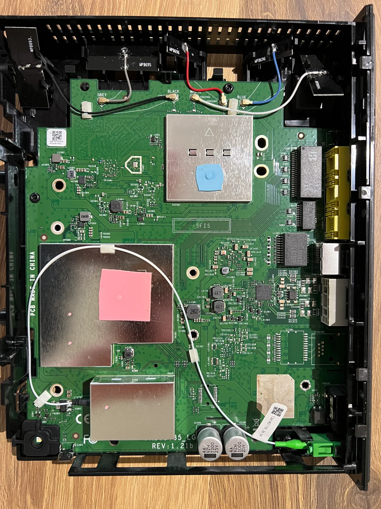

*The first look inside, before removing the mainboard and EMI shielding.*

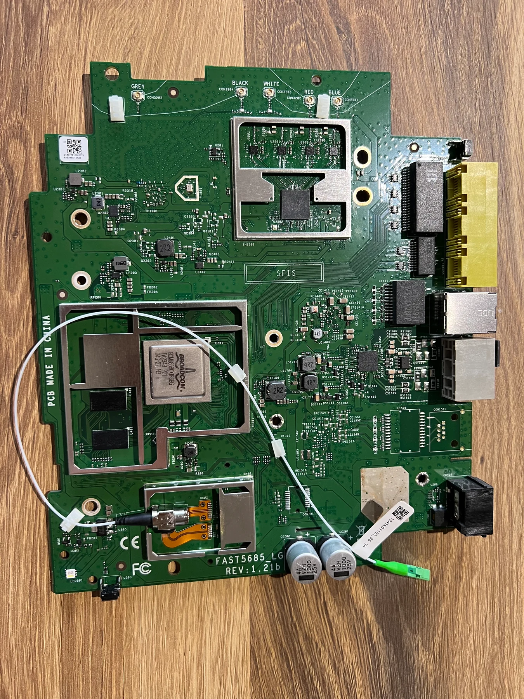

*The front of the mainboard with the shielding opened.*

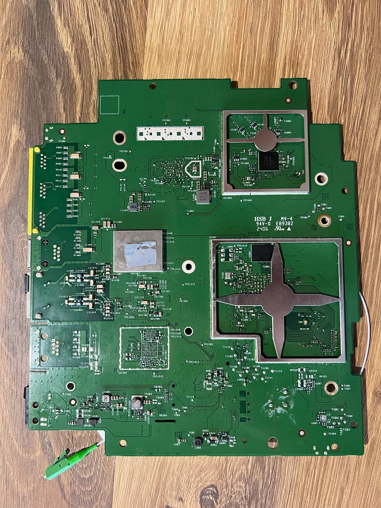

*The back. The NAND sits opposite the main processor and RAM.*

## Board overview

Removing the EMI shielding made the basic layout easy to follow. The Wi-Fi section and antenna connections occupy the upper part of the board, while a Broadcom `BCM68580XIFSBG` in the center acts as the main SoC. Two SK Hynix packages next to it provide the RAM, and the flash chip sits on the back side in roughly the same area. The Ethernet connectors and their supporting circuitry line one edge of the board. Separate from those connectors, the XGS-PON cable runs to its own receiver circuitry at the lower end of the board.

Before committing to soldering work, I looked for a hardware interface. On devices like these, four adjacent pins for power, ground, transmit, and receive often lead to a UART console, potentially providing system access with very little effort. I checked the obvious candidates on both sides of the board, but found nothing that smelled like UART.

Finally, with all other options out of the way, the flash became the target. It is a Spansion/Cypress `S34ML04G2`: 4 Gbit, or 512 MiB, of SLC NAND in a BGA63 package. Reading it directly meant desoldering all 63 connections hidden underneath the package, which was well beyond what can be done with a normal soldering setup.

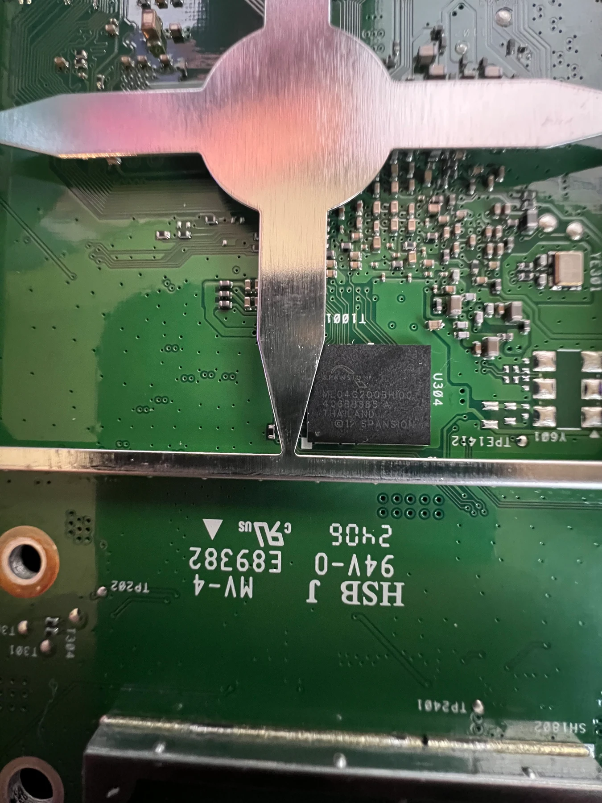

*The target: a Spansion/Cypress S34ML04G2-family NAND package inside the shielding frame.*

## Aaron's lab

This is where Aaron entered the picture. He studies electrical engineering at ETH and has the kind of setup I would normally expect to find in a lab: an IR6500 BGA rework station with top and bottom heaters, a microscope, an oscilloscope, flash programmers, adapter boards, and pretty much every other tool for BGA work. And somehow, he has crammed all of this into his student dorm.

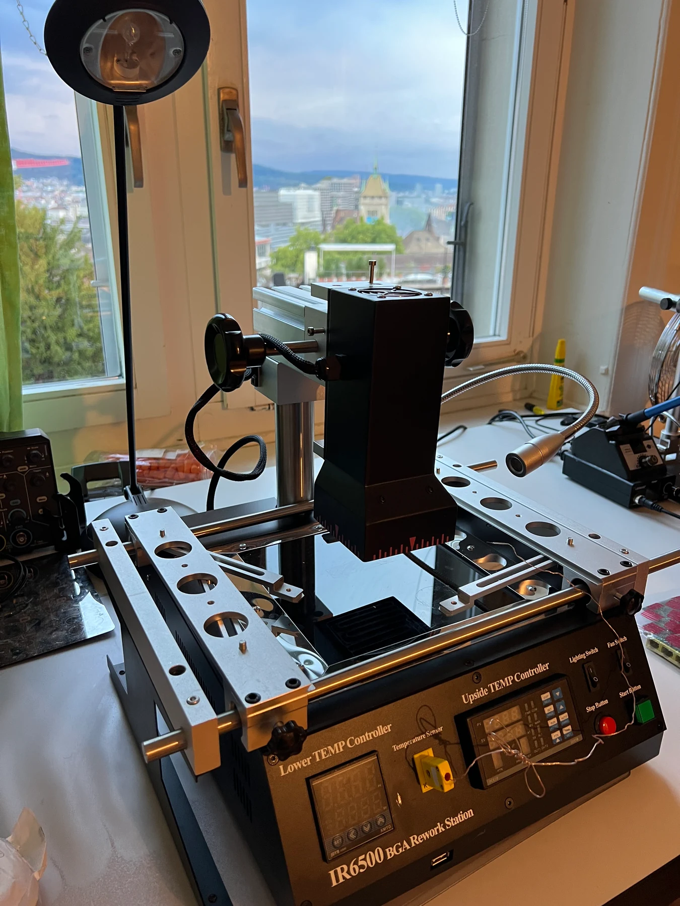

*Aaron's BGA rework station, overlooking Zurich HB and the Landesmuseum. I am not sure whether the setup or the view is better.*

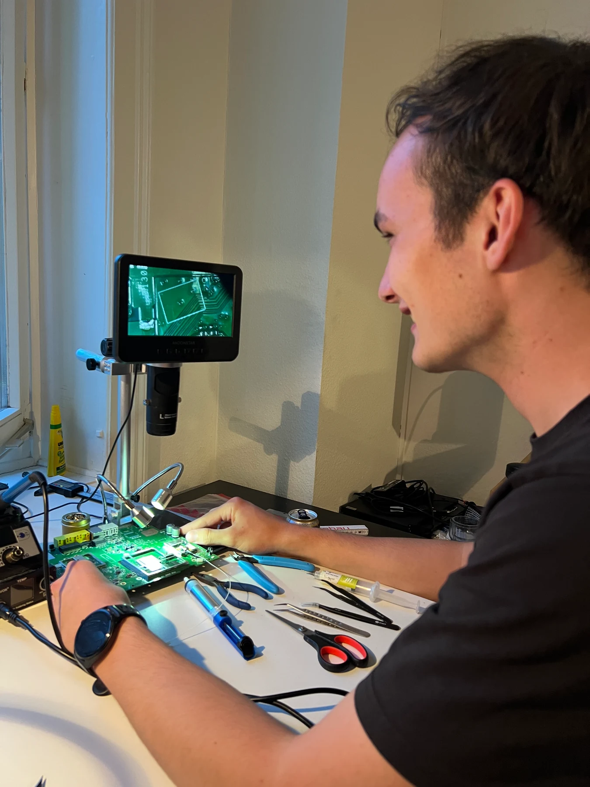

*Aaron at the microscope.*

When I told Aaron about the project, he was almost more excited about dumping the router than I was. We met on a Friday evening, I brought the butchered Sagemcom, and we started preparing the board.

## Desoldering the NAND

Before applying any heat, we removed the remaining plastic and everything else we could detach from the board. The XGS-PON cable refused to come off cleanly, so we covered it using reflective tape along with the nearby plastic and surrounding components. We also taped thermocouples to the board so we could monitor what the heaters were actually doing.

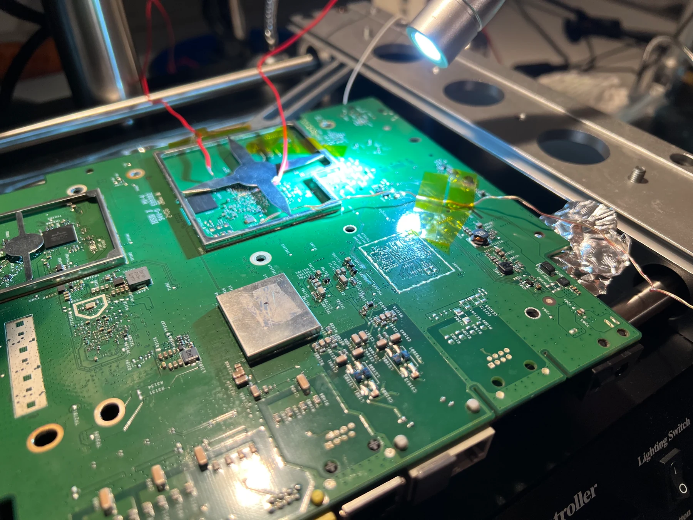

*The board on the bottom heater after we protected the surrounding area and attached the thermocouples.*

The process itself was straightforward: the bottom heater gradually preheated the board, while the upper infrared element concentrated additional heat on the NAND. Preheating reduced the temperature gradient across the PCB, and the focused top heater brought the target joints to reflow without doing the same to every component surrounding it.

The main complication was the metal shielding frame around the NAND, which quickly carried heat away from exactly where we needed it. After what felt like an eternity, the solder beneath the package finally melted. Aaron said "now", lifted the package straight up, and carefully avoided the surrounding SMD components. It came off buttery smooth.

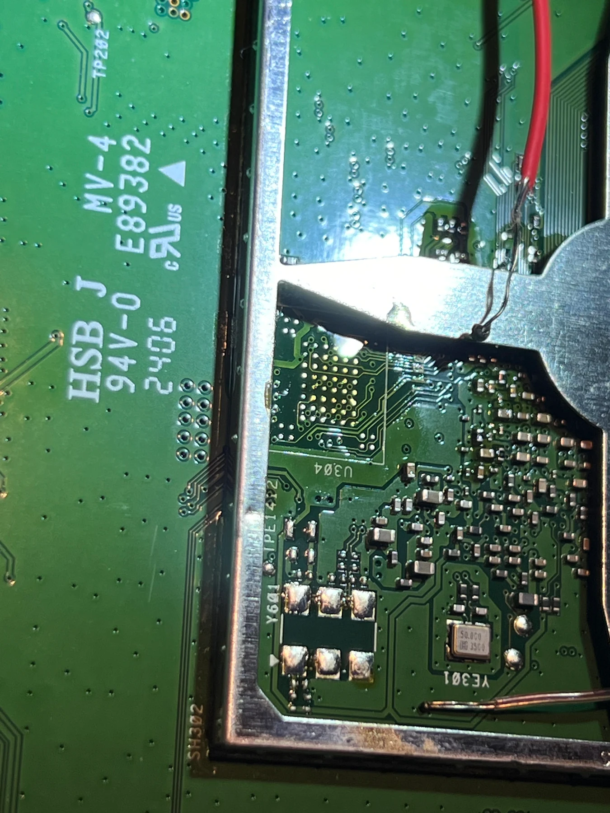

*The NAND footprint immediately after removing the chip.*

With the NAND safely off the board, we used a soldering iron and solder wick to remove the remaining solder from its underside until the BGA63 contacts were flat and visible again.

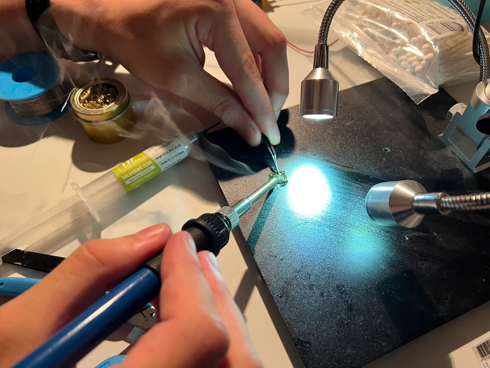

*Cleaning the package under the microscope.*

## The wrong adapter

We initially planned to place the cleaned NAND into a spring-loaded socket and read it without reballing the package. To communicate with the programmer, Aaron used Xgpro, a weird Windows application he had downloaded from some Chinese website.

We mounted the chip and connected the socket. The confusing part was that this nominally BGA48 adapter did have a removable white insert labelled `BGA63 9x11`, and our package physically fit inside it. Apparently that still only made the socket compatible with certain BGA63 layouts; ours was not one of them. Xgpro reported bad connections across the chip and could not identify it, so this NAND still required the separate adapter board.

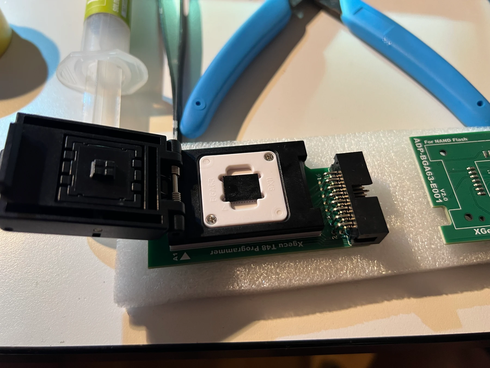

*The white insert is labelled BGA63 9x11, but this particular BGA63 layout still did not make contact correctly.*

The alternative was a bare BGA63 adapter board. Instead of pressing the chip against spring contacts, it provided a matching set of pads for soldering the NAND directly. The board then connected those pads to the programmer.

The catch was that soldering the NAND to the adapter required us to rebuild the contacts we had just cleaned from the chip.

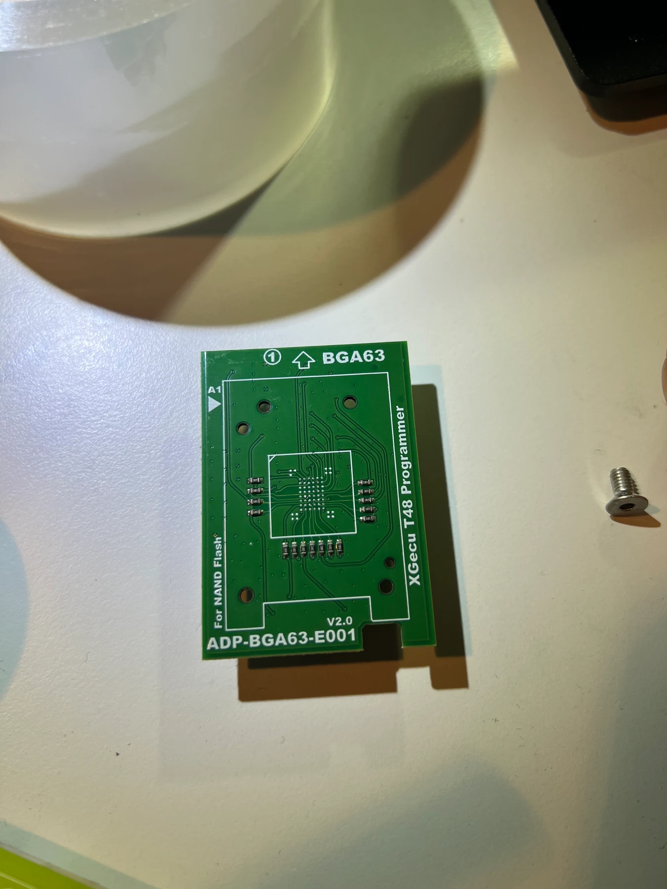

*The solder-down BGA63 adapter board we already had available.*

We could either order the correct socket and wait several weeks, or bite the bullet: reball the NAND, solder it directly to the adapter, and continue immediately. Neither of us wanted to stop at this point.

## Reballing

When Aaron pulled out the equipment for reballing, I finally realized that *ball grid array* is an entirely literal name: actual _balls_ of solder form the connections underneath the package. I had used the term BGA plenty of times before without ever thinking too hard about the "ball" part.

Reballing therefore means placing a new solder ball over each contact pad, then heating the package until they melt and bond to the pads during reflow. Before placing them, Aaron spread a thin layer of flux across the chip. Besides helping the solder wet the pads during reflow, it gave the tiny balls enough tack to stay where we put them... and made them stick to pretty much everything else they touched. Yes, _everything_. For the regular grid, we used a reballing stencil: a thin metal mask with grids of holes. Aaron had several masks with different dimensions, so we tried them under the microscope until we found one whose holes aligned with the regular inner grid of the NAND, which used 0.40 mm solder balls. For anyone wondering how large those are in practice: pretty f***ing small.

The matching stencil still contained far more holes than the chip required. We taped over the unused parts until the exposed area matched the size of the inner grid, keeping loose balls out of all the positions we did not want to populate.

We aligned the package beneath the taped stencil and poured the balls across it so one could settle into each open hole. This took care of the regular center area, but we still had to fill the unusual outer part of the BGA63 pattern by hand.

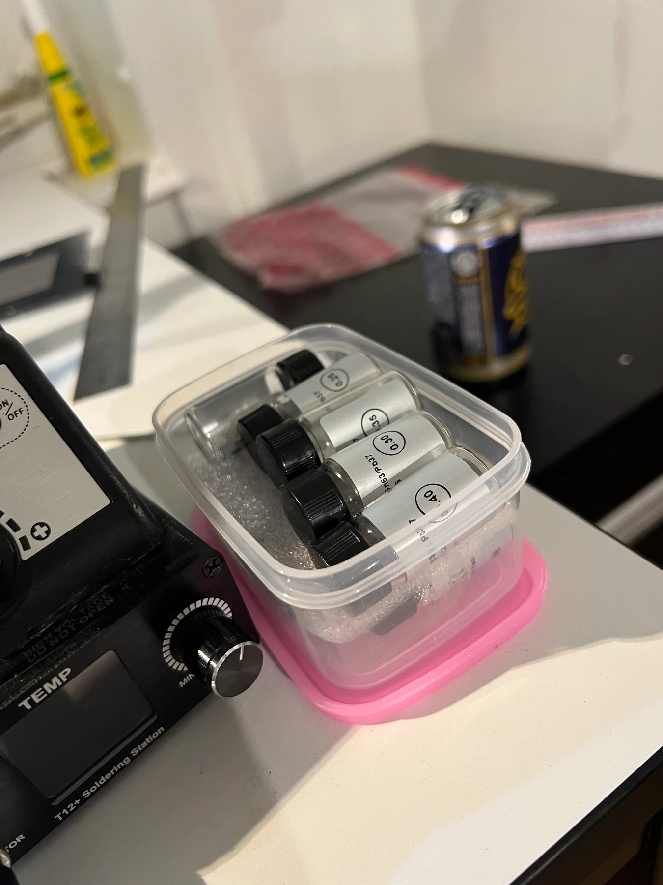

*0.30, 0.35, and 0.40 mm solder balls. We used the 0.40 mm vial.*

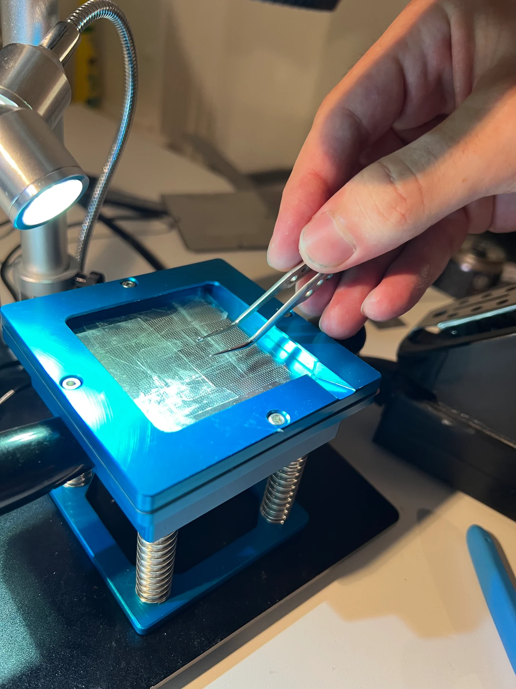

*The taped stencil exposes only the section matching the NAND's inner grid.*

Using the microscope and a tiny plastic tool, we moved the remaining balls into position one by one. This is the kind of work you have to do between heartbeats, because otherwise your hand moves too much. Once all 63 positions looked correct, we heated the chip again. During reflow, the balls melted and bonded to their pads.

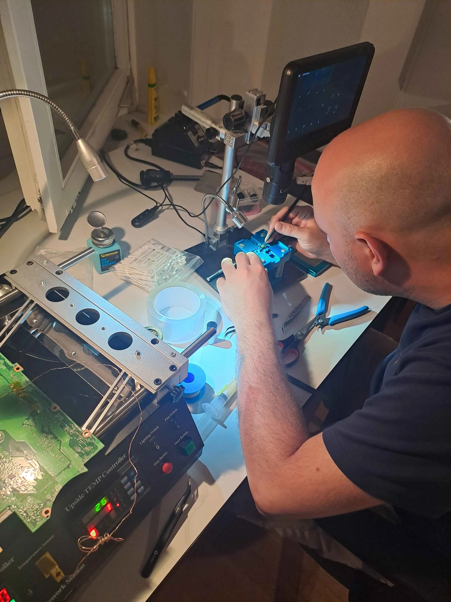

*Me placing the remaining balls under the microscope and trying not to breathe too much.*

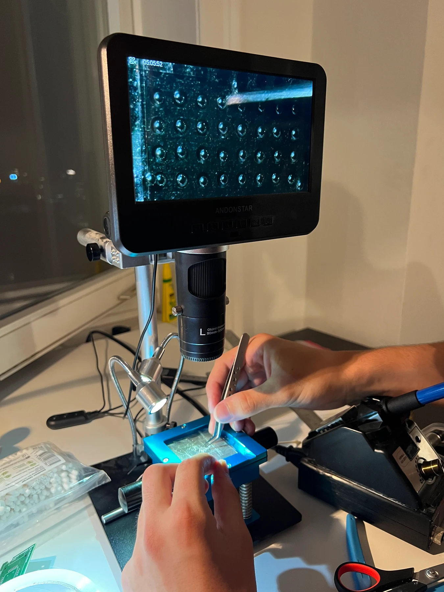

*The newly placed solder balls under the microscope, before reflow.*

One ball ended up slightly misaligned, so we removed it with solder wick, placed a replacement, and repeated the reflow.

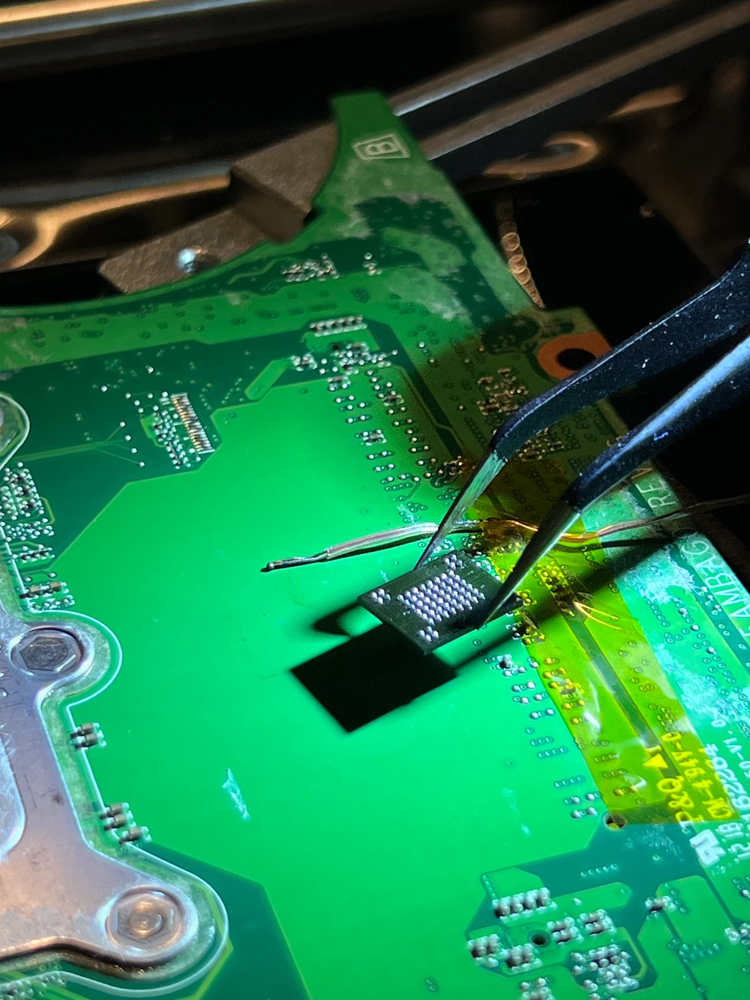

*The completed BGA63 ball pattern before mounting the chip on the adapter.*

The finished chip then went onto the solder-down adapter, where we spent another ten minutes aligning it with the pads.

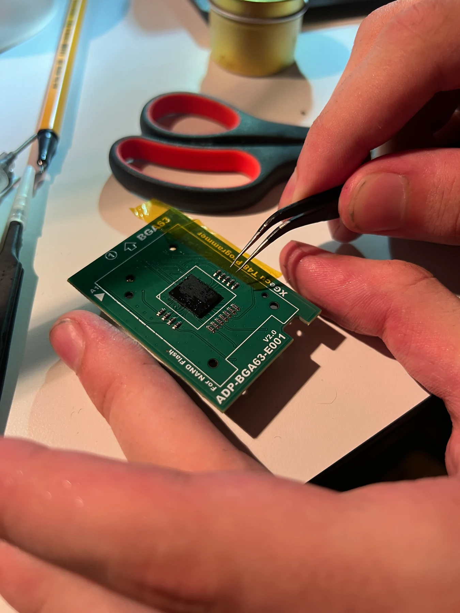

*Aligning the NAND with the pads on the BGA63 adapter board.*

Once the alignment was correct, we heated the whole assembly to reflow the solder balls one last time. This final reflow soldered the NAND directly to the adapter.

## Reading the NAND

After finishing the rework, we connected the adapter to an XGecu T48 programmer. Xgpro identified it as a TL866-3G, and version 13.16 of the software contained a matching `S34ML04G200Bxx00 @BGA63` entry. Better yet, the programmer detected all pins and returned the chip ID `01 DC 90 95`.

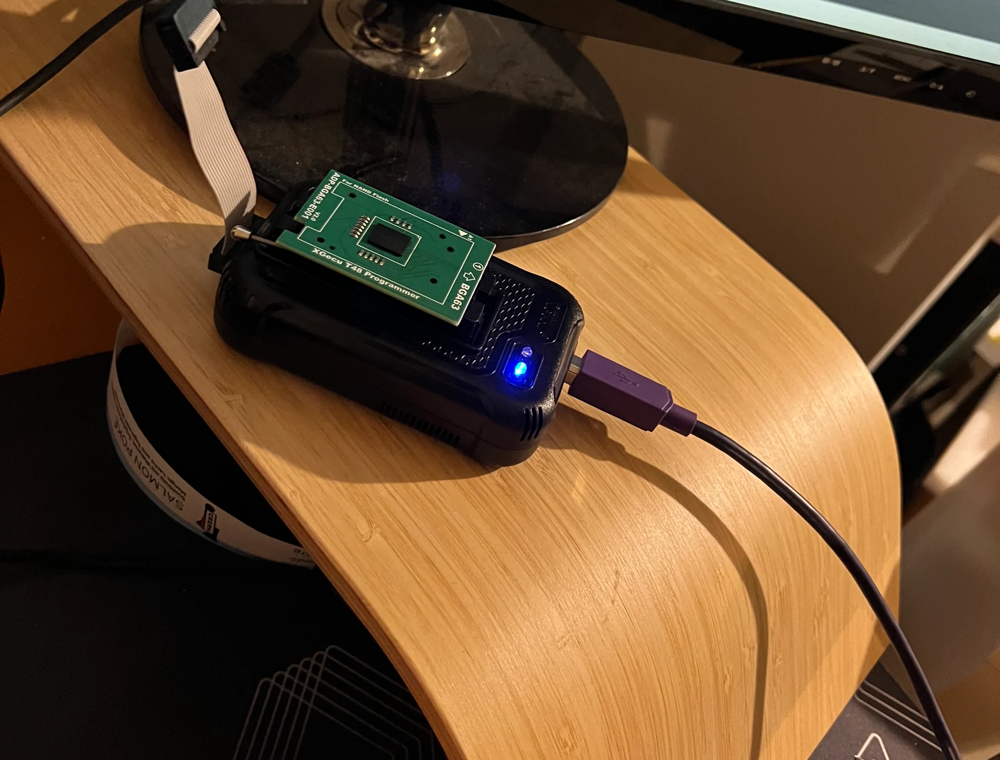

*The NAND soldered to the BGA63 adapter and connected to the XGecu T48 programmer.*

That was a good sign, but the actual moment of truth was the full read. We pressed **Read** and waited. When the progress counter started moving, both of us jumped into the air. After all the desoldering, cleaning, reballing, and reflowing, the chip was alive and returning data.

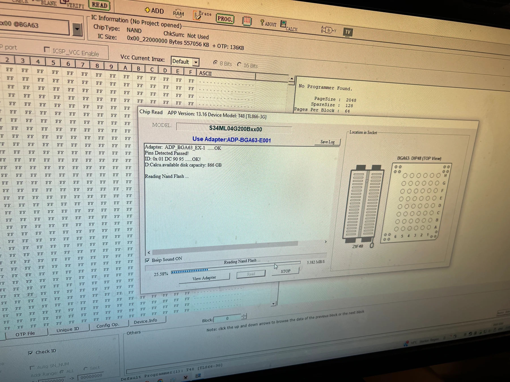

*Successfully reading the raw NAND.*

The read produced a 544 MiB raw image, including the out-of-band data. We immediately followed it with a full verification pass, which succeeded.

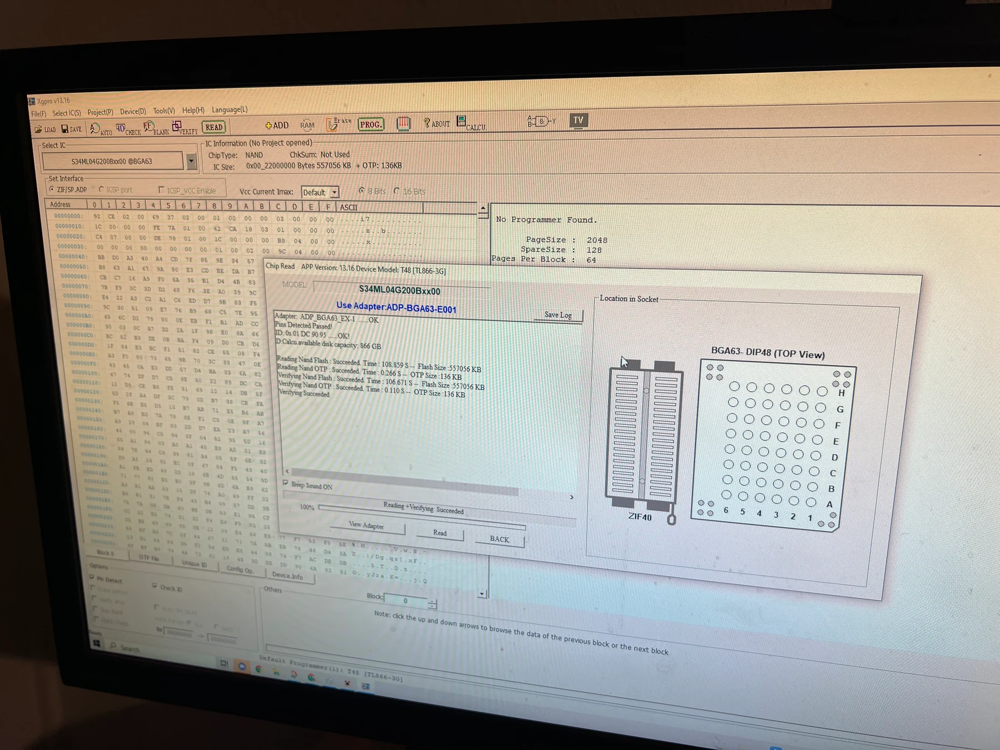

*The read and verification both succeeded.*

## Flash layout

Back home, I started taking the raw image apart. After separating the out-of-band bytes from the page data, the image resolved into a small boot area followed by a UBI container holding almost everything else. Its volumes included two boot filesystems, two root filesystems, writable data, and the factory defaults. The duplicated boot and root volumes form an A/B update layout, allowing the router to update one firmware bank while retaining the other as a fallback.

The more useful result was the root filesystem itself. It used normal read-only SquashFS with XZ compression and, importantly, no encryption. Both `file` and `unsquashfs` recognized it directly, and I could extract the complete directory tree without a key or any decryption step.

That tree identified the system as a 32-bit ARM Linux userland using RDK-B, short for Reference Design Kit for Broadband. RDK-B provides a common software stack for ISP gateways, while BusyBox packs many standard Unix command-line tools into a single compact executable. The root contained the usual embedded Linux directories, but two locations mattered most: `/www` contained the browser frontend and the JSE REST handlers behind it, while `/usr/ccsp` held the RDK-B components responsible for services such as networking, Wi-Fi, telemetry, and device management.

The filesystem layout kept the read-only operating system separate from writable device state. `/nvram` was a symbolic link to `/data/rdkb_nvram`, placing persistent settings on the writable data volume instead of inside SquashFS. With the filesystem extracted, the top level looked like this:

```text
# ls -la /
drwxrwxrwx  2 root root   432 Apr  2 19:10 .
drwxrwxrwx  2 root root   432 Apr  2 19:10 ..
drwxr-xr-x  2 root root  2402 Apr  2 19:09 bin
drwxr-xr-x  2 root root     3 Apr  2 19:10 bootfs
-rw-r--r--  1 root root 12603 Apr  2 19:09 build_info.txt
lrwxrwxrwx  1 root root    24 Apr  2 19:10 crontabs -> /var/spool/cron/crontabs
drwxr-xr-x  2 root root     3 Apr  2 19:10 data
lrwxrwxrwx  1 root root    16 Apr  2 19:10 debug -> sys/kernel/debug
drwxr-xr-x  2 root root    27 Apr  2 19:10 dev
drwxr-xr-x  2 root root  2712 Apr  2 19:10 etc
drwxr-xr-x  2 root root    27 Apr  6  2011 home
drwxr-xr-x  2 root root  2133 Apr  2 18:45 lib
drwxr-xr-x  2 root root     3 Apr  6  2011 minidumps
drwxr-xr-x  2 root root     3 Apr  6  2011 mnt
lrwxrwxrwx  1 root root    16 Apr  2 19:10 nvram -> /data/rdkb_nvram
drwxr-xr-x  2 root root     3 Apr  6  2011 nvram2
drwxr-xr-x  2 root root    99 Apr  2 19:09 opt
drwxr-xr-x  2 root root     3 Apr  6  2011 proc
drwxr-xr-x  2 root root   605 Apr  2 19:09 rdklogger
drwxr-xr-x  2 root root     3 Apr  6  2011 rdklogs
drwxr-xr-x  2 root root     3 Apr  2 19:09 run
drwxr-xr-x  2 root root   994 Apr  2 19:09 sbin
drwxr-xr-x  2 root root    29 Apr  2 19:10 sys
drwxr-xr-x  2 root root     3 Apr  6  2011 telemetry
drwxr-xr-t  2 root root     3 Apr  6  2011 tmp
drwxr-xr-x  2 root root   225 Apr  2 19:09 usr
drwxr-xr-x  2 root root   130 Apr  2 19:09 var
-rw-r--r--  1 root root   152 Apr  2 19:09 version.txt
drwxr-xr-x  2 root root   107 Apr  2 19:09 www
```

The raw dump had now turned into a complete operating system tree: binaries, startup scripts, shared libraries, the web frontend, and its backend handlers.

That is where Part 2 continues. With the complete filesystem in hand, we can properly explore the services running on the router, trace how its various features work, and figure out what modem mode actually does.

And along the way, we might even find a vulnerability or two.

---

*This is Part 1 of my Home Router project. No routers were harmed in the making of this post. Well, one was.*
