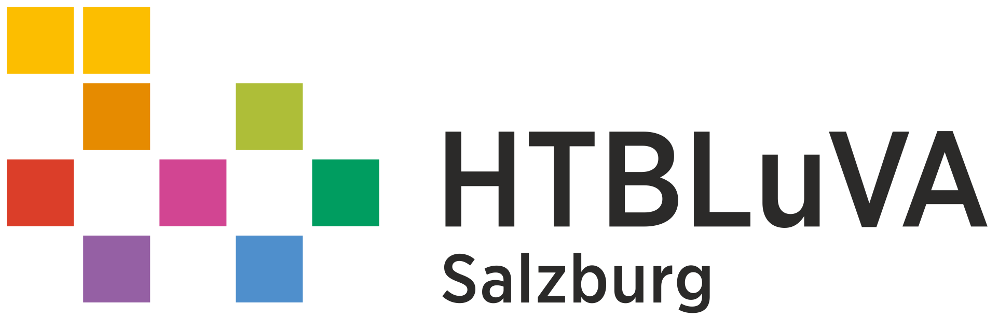
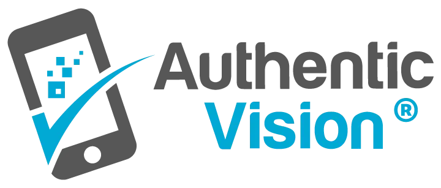
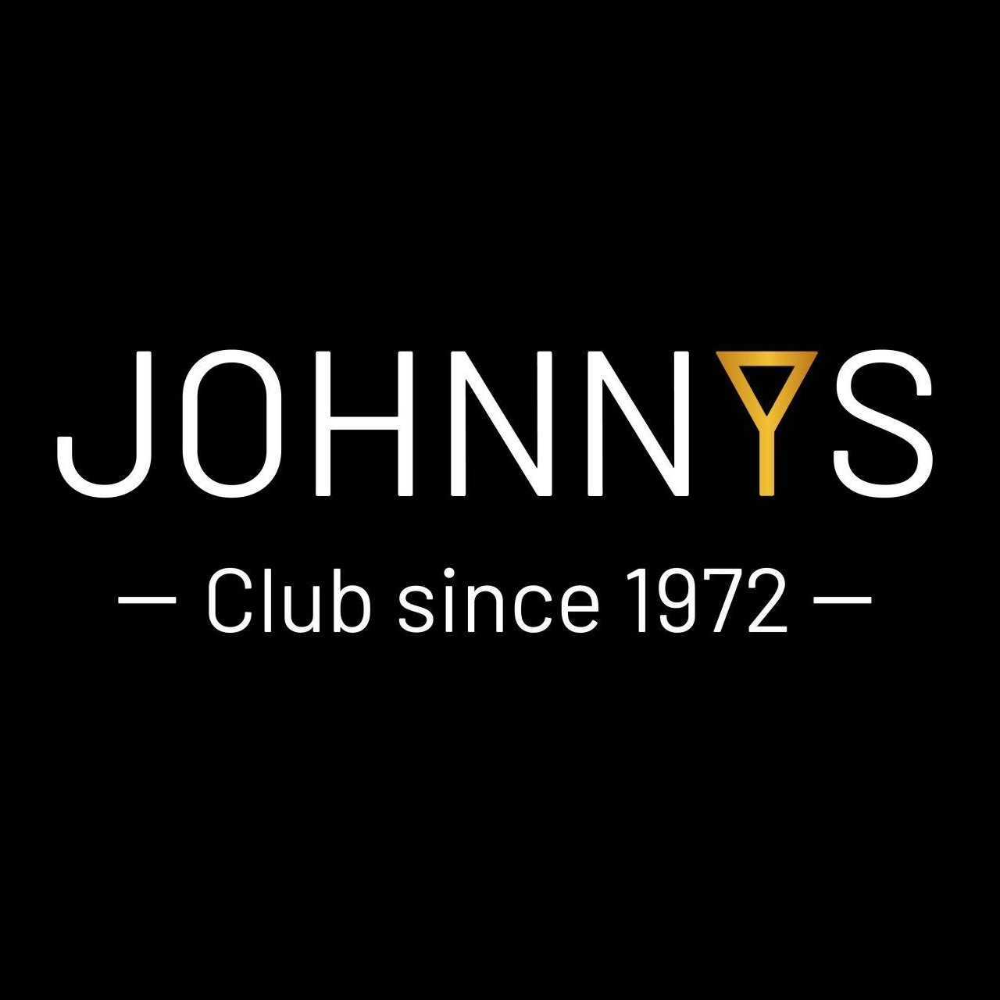
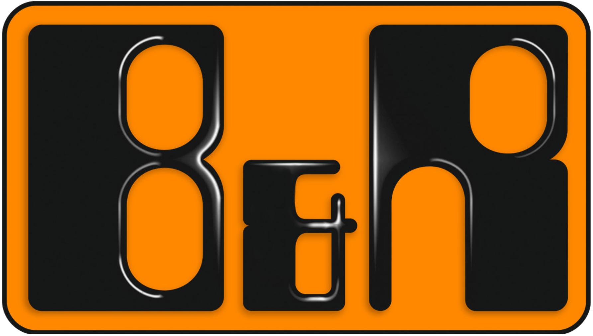
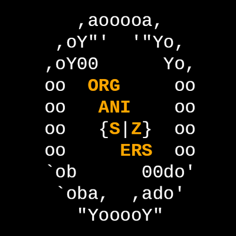

## Education

<table class="resumeTable">
    <thead>
        <tr>
            <th>Institution</th>
            <th>Degree</th>
            <th>Dates</th>
            <th>Location</th>
        </tr>
    </thead>
    <tbody>
        <tr>
            <td>
<a href="https://ethz.ch/" target="_blank">ETH Zürich</a>
</td>
            <td>MSc. Cyber Security</td>
            <td>2024 - Present</td>
            <td>Zürich, CH</td>
        </tr>
        <tr>
            <td>
<a href="https://epfl.ch/" target="_blank">EPFL</a>
</td>
            <td>MSc. Cyber Security (exchange)</td>
            <td>2025 (Feb - Jul)</td>
            <td>Lausanne, CH</td>
        </tr>
        <tr>
            <td>
<a href="https://ethz.ch/" target="_blank">ETH Zürich</a>
</td>
            <td>BSc. Computer Science (exchange)</td>
            <td>2024 (Apr - May)</td>
            <td>Zürich, CH</td>
        </tr>
        <tr>
            <td>
<a href="https://www.plus.ac.at/" target="_blank">University of Salzburg</a>
</td>
            <td>BSc. Computer Science</td>
            <td>2021 - 2024</td>
            <td>Salzburg, AT</td>
        </tr>
        <tr>
            <td>
<a href="https://www.htl-salzburg.ac.at/" target="_blank">HTBLuVA Salzburg</a>
</td>
            <td>Biomedical Engineering</td>
            <td>2014 - 2019</td>
            <td>Salzburg, AT</td>
        </tr>
    </tbody>
</table>

---

## Work Experience and Internships

<table class="resumeTable">
    <thead>
        <tr>
            <th>Company</th>
            <th>Role</th>
            <th>Dates</th>
            <th>Location</th>
        </tr>
    </thead>
    <tbody>
        <tr>
            <td>
<a href="https://netsec.ethz.ch/" target="_blank">Network Security Group @ ETH Zurich</a>
</td>
            <td>Research</td>
            <td>2024 - Present</td>
            <td>Zürich, CH</td>
        </tr>
        <tr>
            <td>
<a href="https://www.plus.ac.at/" target="_blank">University of Salzburg</a>
</td>
            <td>Teaching Assistant</td>
            <td>2023 (Sep - Dec)</td>
            <td>Salzburg, AT</td>
        </tr>
        <tr>
            <td>
<a href="https://authenticvision.com/" target="_blank">Authentic Vision GmbH</a>
</td>
            <td>Software Development</td>
            <td>2021 - 2024</td>
            <td>Salzburg, AT</td>
        </tr>
        <tr>
            <td>
<a href="https://www.raiffeisen.at/" target="_blank">Raiffeisen ORG/IT</a>
</td>
            <td>Software Development</td>
            <td>2020 (Sep - Dec)</td>
            <td>Salzburg, AT</td>
        </tr>
        <tr>
            <td>
<a href="https://wavelab.at/" target="_blank">WaveLab @ University of Salzburg</a>
</td>
            <td>Internship</td>
            <td>2018 (Aug - Sep)</td>
            <td>Salzburg, AT</td>
        </tr>
        <tr>
            <td>
<a href="https://www.johnnys.at" target="_blank">Johnnys Disco</a>
</td>
            <td>Event Technician</td>
            <td>2018 - 2024</td>
            <td>Salzburg, AT</td>
        </tr>
        <tr>
            <td>
<a href="https://www.br-automation.com/" target="_blank">B&amp;R Industrial Automation</a>
</td>
            <td>Internship</td>
            <td>2017 (Aug - Sep)</td>
            <td>Eggelsberg, AT</td>
        </tr>
        <tr>
            <td>
<a href="https://www.raiffeisen.at/" target="_blank">Raiffeisen Technik-Zentrum</a>
</td>
            <td>Internship</td>
            <td>2016 (Jul - Aug)</td>
            <td>Salzburg, AT</td>
        </tr>
    </tbody>
</table>

## Associations

<table class="resumeTable">
    <thead>
        <tr>
            <th>Organization</th>
            <th>Description</th>
            <th>Role</th>
            <th>Location</th>
        </tr>
    </thead>
    <tbody>
        <tr>
            <td>
<a href="https://org.anize.rs/" target="_blank">0rganisers</a>
</td>
            <td>CTF Team</td>
            <td>Member</td>
            <td>International</td>
        </tr>
        <tr>
            <td>
<a href="https://www.defcon-switzerland.org/" target="_blank">DEFCON Switzerland</a>
</td>
            <td>Local Hacker Group</td>
            <td>Member</td>
            <td>CH</td>
        </tr>
        <tr>
            <td>
<a href="https://www.koes.ch/" target="_blank">KÖS - Klub der Österreichischen Studierenden</a>
</td>
            <td>Club of Austrian Students in Zurich</td>
            <td>President</td>
            <td>Zürich, CH</td>
        </tr>
        <tr>
            <td>
Mensa
</td>
            <td>Interest Society</td> <!-- Why are people so stigmatizing?? -->
            <td>Member</td>
            <td>AT + CH</td>
        </tr>        
    </tbody>
</table>

---

*You can also find a more personal introduction about me right [here](/aboutme/).*
